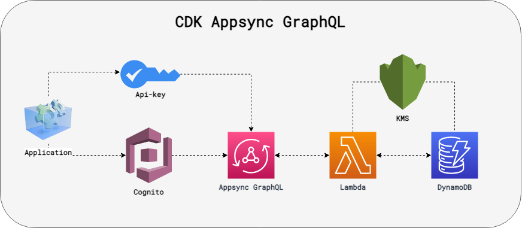

# AWS CDK TypeScript Appsync GraphQL

This repository contains a Appsync GraphQL API with a Lambda resolver.
The stack also imports a KMS key, Cognito userpool and DynamoDB table for granting permisions.

## Useful commands

| Command  | Description    |
|----------|----------------|
|`npm run build`|compile typescript to js|
|`npm run test`|perform the jest unit tests|
|`npm run lint`|perform static analyses on code|
|`cdk bootstrap`|bootstrap aws for cdk on first time using cdk|
|`cdk diff`|compare deployed stack with current state|
|`cdk synth`|emits the synthesized CloudFormation template|
|`cdk deploy`| deploy this stack to your default AWS account/region|
